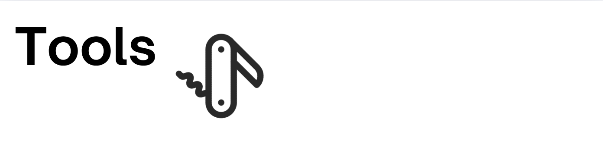

Docker image for installing and running tools for LLM agents (MCP, OpenAPI, UVX, NPX, Python)

### Features

- Python / Node.js runtime - includes `python`, `node`, `uvx`, `npx`
- Includes extra packages for managing MCP/OpenAPI tools and connections
  - `mcpo` - MCP to OpenAPI bridge
  - `supergateway` - MCP STDIO/SSE bridge

### Usage

```bash
docker run -it \
  ghcr.io/av/tools:latest \
  uvx mcp-server-time
```

---

Check out [Harbor](https://github.com/av/harbor) for a complete dockerized LLM environment.